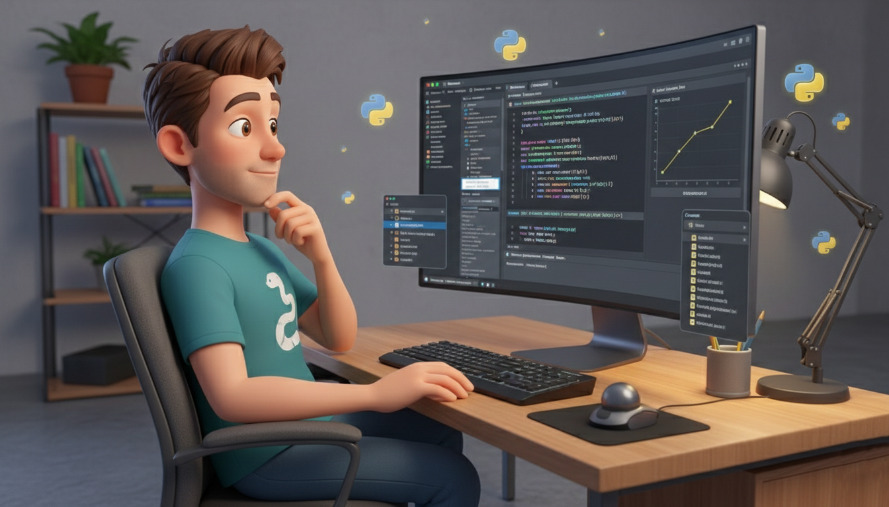

<h1 align="center">
  Python Playground 🐍
</h1>

<h3 align="center" style="margin: 20px 0;">
  A hands-on playground for learning Python concepts. This is a personal playground where I experiment with Python concepts, write small programs, and practice problem-solving. The goal of this repository is to improve my understanding of Python and strengthen my programming skills.
</h3>

<div align="center">
  
</div>

## Topics Covered

The repository includes examples and practice code for various Python concepts, such as:

- Variables and Data Types
- Type Casting
- Comments and Escape Sequences
- String Operations and Slicing
- Conditional Statements
- Control Flow and Loops
- Functions and Lambda Functions
- Basic Python Programs and Exercises

More topics will be added as I continue learning and practicing Python.

## How to Run the Code

1. Install Python (version 3.x recommended).

2. Clone this repository:

```
git clone https://github.com/soumadip-dev/Python-Playground.git
```

3. Navigate to the project folder:

```
cd Python-Playground
```
