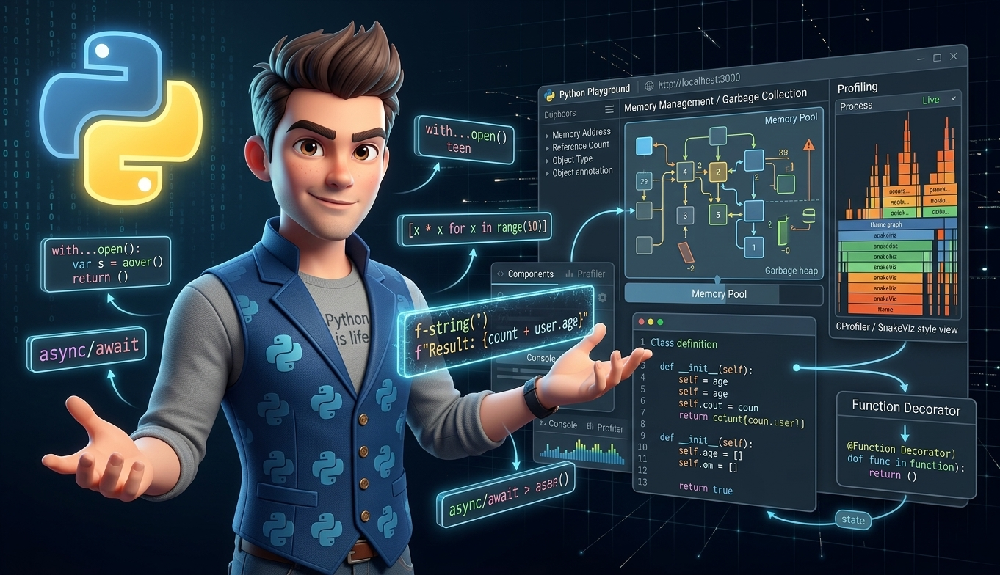

<h1 align="center">
  Python Playground 🐍
</h1>

<h3 align="center" style="margin: 20px 0;">
A hands-on space to learn and practice Python through small programs and experiments, helping explore concepts and improve problem-solving skills.
</h3>

<div align="center">
  
</div>

## Topics Covered

This repository contains practice programs covering core Python concepts:

- **Basics:** Variables, Data Types, Type Casting, Comments, Escape Sequences
- **Strings:** Operations, Methods, and Slicing
- **Control Flow:** Conditional Statements, Match-Case, Loops (For, While), Break, Continue, Pass
- **Functions:** Functions, Lambda, Recursion, Args & Kwargs, Return Values
- **Modules:** Built-in, External (pip), Custom Modules
- **Scope & Documentation:** Variable Scope, Docstrings
- **Data Structures:** Lists, Tuples, Sets, Dictionaries, List Comprehensions
- **OOP:** Classes, Objects, Constructors, Inheritance, Composition, Polymorphism, Abstraction, Encapsulation, Method Resolution Order
- **Advanced Concepts:** Dunder Methods, Exception Handling (Try, Except, Finally), Map, Filter, Reduce, Walrus Operator, Iterators & Generators
- **File Handling:** Reading, Writing, Appending Files, Working with Different File Modes
- **Libraries & Tools:** os, shutil, argparse, requests, threading, regular expressions, virtual environments
- **External Modules & Packages:** Installation and Usage with pip
- **Flask:** Web Framework, Routing, Templates, Forms, Jinja Templates, Static Files, APIs using `jsonify`, Message Flashing
- **Practice:** Basic Python Programs and Exercises

More topics will be added as learning continues.

## Requirements

- Python 3.x
- pip (Python package manager)

## How to Run the Code

1. Install Python (version 3.x recommended).

2. Clone this repository:

```
git clone https://github.com/soumadip-dev/Python-Playground.git
```

3. Navigate to the project folder:

```
cd Python-Playground
```
